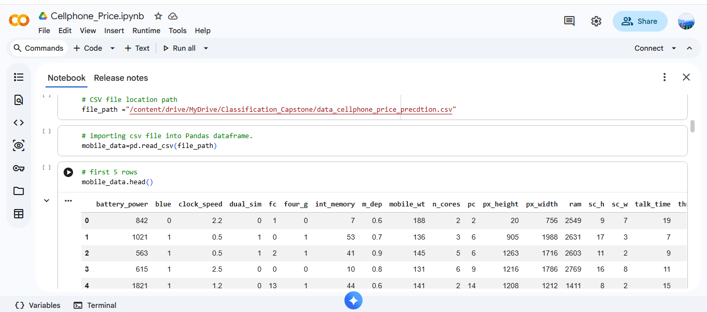
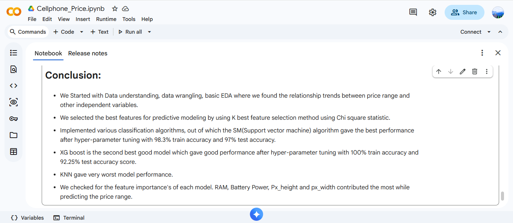

# 📱 Cellphone Price Range Prediction

This project uses machine learning to classify mobile phones into different price ranges based on hardware specifications.

---

## 🚀 Problem Statement
Predict the price category (low, medium, high, very high) of mobile phones using features like RAM, battery power, camera, and display.

---

## 🛠️ Technologies Used
- Python  
- Pandas, NumPy  
- Scikit-learn  
- Matplotlib, Seaborn  

---

## 📊 Project Workflow
- Data Cleaning & Preprocessing  
- Exploratory Data Analysis (EDA)  
- Feature Selection (Chi-Square Test)  
- Model Training & Evaluation  

---

## 🤖 Models Used
- Support Vector Machine (SVM)  
- Random Forest  
- K-Nearest Neighbors (KNN)  

---

## 📈 Results
- SVM achieved:
  - **98% Training Accuracy**
  - **97% Testing Accuracy**

---

## 🔍 Key Insights
- RAM is the most important feature  
- Battery power and pixel resolution also influence pricing  
- KNN showed the lowest performance  

---
## 📊 Project Visuals

### Correlation Heatmap

### Dataset Overview

### Conclusion

---

## 📌 Conclusion
Machine learning models can effectively classify mobile phone price ranges and help businesses understand pricing strategies.
